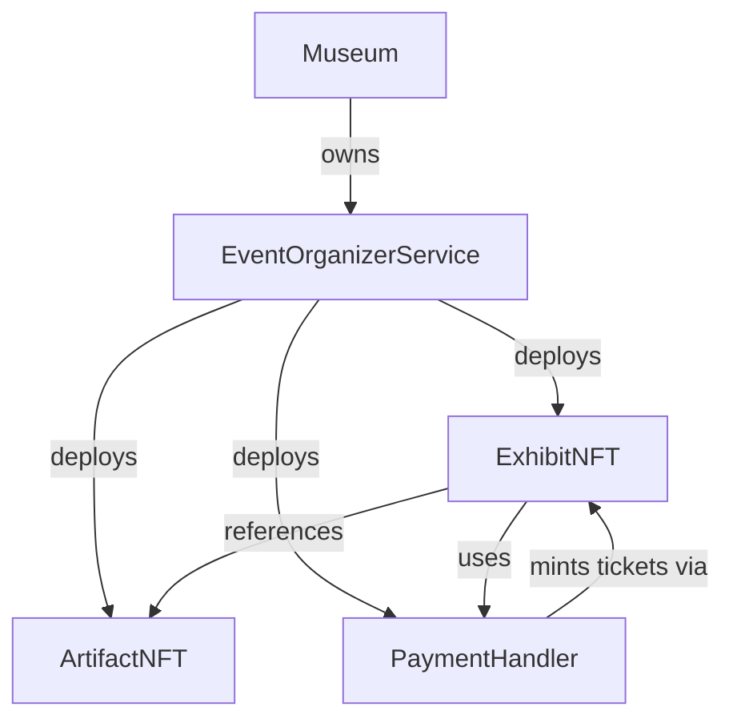

# SummitShare Contracts (RVS-m v2)

SummitShare is a decentralized platform for organizing and managing virtual exhibits. This repository contains the smart contracts that power the platform's core functionality, including exhibit creation, ticket sales, and revenue sharing.

## Quick Start

```bash
git clone https://github.com/your-username/SummitShare-Contracts.git
cd SummitShare-Contracts
npm installent e
cp .env.example .env  # Configure your environment variables
npm run build
```

## Contract Architecture



## Core Contracts

### Museum
- Central hub for curating exhibits and managing ticket verification
- Owned by EventOrganizerService
- Maintains registry of all exhibits

### EventOrganizerService
- Main orchestrator for exhibit deployment and management
- Deploys ArtifactNFT and ExhibitNFT contracts
- Configures PaymentHandler for revenue sharing

### ArtifactNFT (ERC721A)
- Represents artifacts in an exhibit
- Optimized for batch minting
- Customizable base URI for metadata

### ExhibitNFT (ERC721)
- Represents tickets for an exhibit
- Implements ITicketing interface
- Links to associated ArtifactNFT collection

### PaymentHandler
- Manages payment processing and revenue distribution
- Configurable revenue sharing between beneficiaries
- Supports on-chain ticketing through ExhibitNFT

## Key Scripts

### Base Deployment
```bash
# Deploy base contracts (Museum, EventOrganizerService)
npm run deploy:dev     # For Sepolia testnet
npm run deploy:prod    # For production networks
```

### Configure Exhibit
```bash
# Configure exhibit with ArtifactNFT and ExhibitNFT
npm run configure:dev  # For Sepolia testnet
npm run configure:prod # For production networks
```

### PaymentHandler Deployment
Deploy PaymentHandler to different networks:
```bash
# Testnets
npm run deploy:handler:sepolia          # Ethereum Sepolia
npm run deploy:handler:optimismSepolia  # Optimism Sepolia
npm run deploy:handler:baseSepolia      # Base Sepolia

# Mainnets
npm run deploy:handler:mainnet          # Ethereum Mainnet
npm run deploy:handler:optimism         # Optimism Mainnet
npm run deploy:handler:base             # Base Mainnet
```

### Test Deployment
Run full deployment test including token transfers and payments:
```bash
npm run test:deployment         # Local hardhat network
npm run test:deployment:sepolia # Sepolia testnet
npm run test:deployment:all     # All configured networks
```

## Development Setup

1. Install dependencies:
```bash
npm install
```

2. Configure environment:
```bash
cp .env.example .env
# Add your API keys and private keys to .env
```

3. Compile contracts:
```bash
npm run build
```

## Network Configuration

The system supports multiple networks through Hardhat configuration:

- **Testnets**: Sepolia, Optimism Sepolia, Base Sepolia
- **Mainnets**: Ethereum, Optimism, Base

Each network requires appropriate RPC URLs and API keys configured in `.env`.

## Revenue Sharing

PaymentHandler supports flexible revenue sharing:
- Configurable beneficiary addresses and share ratios
- Automatic distribution of payments
- Support for both ticket sales and donations
- On-chain ticket minting integration

## Testing

Run the test suite:
```bash
npm test                # Run all tests
npm run test:coverage   # Run tests with coverage report
```
